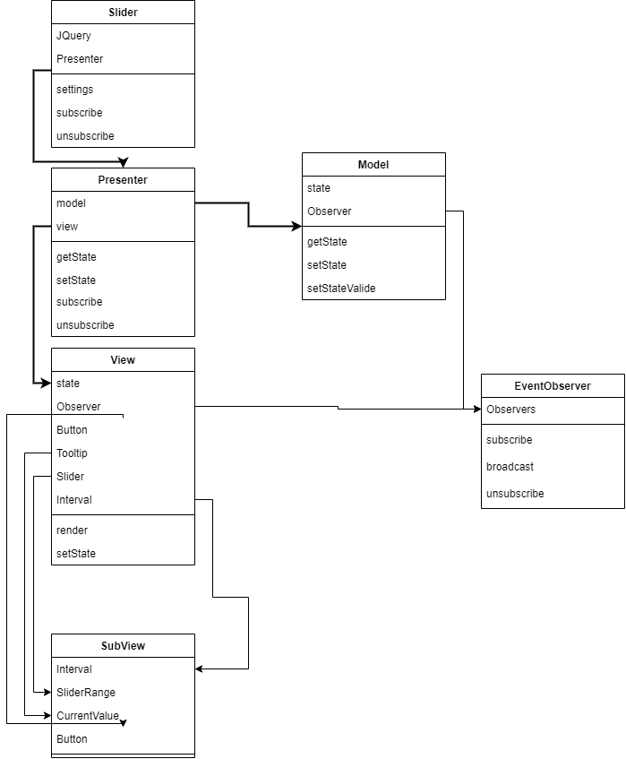

# **SliderRqik**

<a href="https://www.npmjs.com/"></a>
<a href="https://nodejs.org/en/">=15.10.0-ff0062?style=for-the-badge"></a>
<a href="https://ajax.googleapis.com/ajax/libs/jquery/3.5.1/jquery.min.js"></a>

## 🏷️ Содержание

- [**Demo page**](https://rqik.github.io/SliderPlugin/)
- [Использованные технологии](#technology)
- [Установка](#installation)
- [Команды](#commands)
- [Архитектура](#mvp)
- [Структура проекта](#structure)
- [Диаграмма](#diagram)

## <a name="technology"></a> 🤖 Использованные технологии

`TypeScript`
`JQ`
`HTML`
`SCSS`
`MVP pattern архитектуры`
`Observer pattern`
`JEST`
`Webpack`
`Eslint`
`Prettier`
`Babel`

## <a name="installation"></a> 💾 Установка

Инструкции данного раздела следует выполнять в командной строке.

1.Clone

```console
// Скачайте репозиторий
git clone https://github.com/Rqik/SliderPlugin.git

// или
git clone git@github.com:Rqik/SliderPlugin.git
```

2.Open

```console
// Перейдите в папку с репозиторием

cd SliderPlugin
```

3.Init

```console
// Установите зависимости

npm install
```

## <a name="commands"></a> 📗 Команды

### `npm run dev`

Запускает _development_ сборку и сохраняет результат в папку `/dist`.

### `npm run watch`

Запускает _development_ сборку и сохраняет результат в папку `/dist`. Следит за изменениями в коде и переносит изменения в сборку.

### `npm run start`

Запускает _development_ сборку поднимает локальный сервер с результатом сборки.
Не сохраняет результат в файловой системе. Запускает ваш браузер по умолчанию
(если он не запущен), создает вкладку с адресом лок. сервера и переходит к ней.

### `npm run build`

Запускает _production_ сборку и сохраняет результат в папку `/dist`.

### `npm run lint`

Запускает eslint проверку на ошибки в коде. Результат вызова отобразится в консоли.

### `npm run lintfix`

Запускает eslint проверку на ошибки в коде и автоматически исправит проблемный код.
Результат вызова отобразится в консоли.
автоматически исправит проблемный код. Результат вызова отобразится в консоли.

### `npm run stylelint`

Запускает stylelint проверку на ошибки в css/scss и автоматически исправит проблемный код. Результат вызова отобразится в консоли.

### `npm run test`

Запускает jest тестирование и показывает процент покрытия тестами.
Сохраняет в `/coverage` результат проверки тестов.

### `npm run testW`

Запускает jest тестирование.
Следит за изменениям в тестах и перезапускает проверку.

### `npm run testCW`

Запускает jest тестирование и показывает процент покрытия тестами.
Следит за изменениям в тестах и перезапускает проверку.
Сохраняет в `/coverage` результат проверки тестов.

### `npm run deploy`

Развертывает содержимое папки `/dist` в `git` ветку _gh-pages_.

---

## <a name="mvp"></a> 🗿 Архитектура

## Model - View - Presenter

**Model** -отвечает за текущее состояние слайдера, хранит в себе стартовые значения. Имеет методы для изменения текущего состояния и его возврата.

**View** - отвечает за визуальное отображение самого слайдера. Включает в себя отдельные компоненты **subView** и **Observer**. _**subView**_ - хранит в себе компоненты кнопок, подсказок, интервалов и активной зоны. **_Observer_** - добавляет **View** возможность передачи изменения состояния для подписчиков _subscriber_ без необходимости кто это будет. Он передает значение для всех subscriber через broadcast метод.

**Presenter** - отвечает за инициализацию **View** и **Model**. Решает вопрос с передачей данных между компонентами. Подписывается на изменения во View и вызывает соответствующие методы в Model. Принимает в себя значения для инициализации которые передает в Model. Служит посредником. Вызывает методы перерисовки в View и изменения состояния.

> _Для более удобного использования c JQ. Поверх Presenter
> используется функция sliderRqik для подключения нескольких Presenter
> к DomElement имеющим одинаковый selector переданный при
> инициализации._

## Способ подключения

Слайдер автоматически проинициализируется на элементах с классом
**_.slider-rqik_** , при этом опции можно передать через **_data_** атрибуты.

```html
<div class="slider-rqik" data-min-value="99"></div>
```

## _Ручная инициализация_

```javascript
// index.html
<div class="plug"></div>;

// index.js
$('.plug').sliderRqik();
```

## Передача параметров

```javascript
$('.plug').sliderRqik({
  min: 0, // минимальное значение
  max: 100, // максимальное значение
  range: 'two', // 1 или 2 указателя
  rotate: 'horizontal', // ориентация vertical horizontal
  showTooltip: true, // показывать текущее значение над указателем
  showInterval: true, // показать интервал
  intervalCount: 2, // количество интервалов
  stepSize: 1, // шаг движения указателя
  maxValue: 50, // установка значения
  minValue: 0, // установка значения
  shiftLeft: 0,
  shiftRight: 0,
});
```

### min и max

---

Устанавливают минимальные и максимальные значения слайдера
По умолчанию 0 и 100

```javascript
$('.plug').sliderRqik({
  min: -10, // минимальное значение
  max: 2880, // максимальное значение
});
```

### maxValue и minValue

---

Устанавливает стартовые значения кнопок
По умолчанию 0 и 100

```javascript
$('.plug').sliderRqik({
  maxValue: 10, // правая кнопка
  minValue: 0, // левая кнопка
});
```

### range

---

Устанавливает количество кнопок на слайдера
Имеет два состояния **_two | one_**
По умолчанию **_two_**

```javascript
$('.plug').sliderRqik({ range: 'one' });
```

### rotate

---

Устанавливает ориентацию слайдера и имеет два состояния **_vertical | horizontal_**
По умолчанию **_horizontal_**

```javascript
$('.plug').sliderRqik({ rotate: 'vertical' });
```

### showTooltip

---

Отвечает за отображение или скрытие подсказок с текущим значением над кнопками
Имеет два состояния **_true | false_**
По умолчанию **_true_**

```javascript
$('.plug').sliderRqik({ showTooltip: false });
```

### showInterval

---

Отвечает за отображение или скрытие интервалов
Имеет два состояния **_true | false_**
По умолчанию **_true_**

```javascript
$('.plug').sliderRqik({ showInterval: false });
```

### intervalCount

---

Отвечает за отображение или скрытие интервалов
Принимает числовой параметр от 0 и выше
По умолчанию **_2_**

```javascript
$('.plug').sliderRqik({ intervalCount: 4 });
```

### stepSize

---

Задает шаг движения в **числах**
Принимает числовой параметр от 0 и выше
По умолчанию **_0_**

```javascript
$('.plug').sliderRqik({ stepSize: 10 });
```

## Передача параметров через data атрибут

```javascript
// index.html
<div class="plug" data-min="10" data-tooltip-right-value="20"></div>
```

## Установка значений для уже созданных слайдеров

Вызов метода без параметров **_sliderRqik_** возвращает экземпляр jquery элемента
Значения можно установить через передачу через ключевое слово _settings_ и вторым аргумент передать объект с нужными параметрами

```javascript
let $slider = $('.plug').sliderRqik();
$slider.sliderRqik('settings', { max: 99999 }); // установит максимальное значение 99999
```

Доступна возможность передачи объекта без ключевого слова

```javascript
let $slider = $('.plug').sliderRqik();
$slider.sliderRqik({ max: 99999 }); // установит максимальное значение 99999
```

## Получения текущих значений

По ключу **_settings_** можно получить текущее состояние слайдера

```javascript
// index.html
<div class="plug"></div>
<div class="plug"></div>

// index.MVP
let sliderProps = $(".plug").sliderRqik('settings');

// sliderProps теперь хранит состояние обоих элементов
// sliderProps = [{},{}]
```

если экземпляр объекта один вернет объект состояния

## Подписка на изменения

По ключу **_subscribe_** можно подписаться на события изменения.
После изменения состояния будут передаваться измененные свойства

```javascript
// index.html
<div class="plug"></div>

// index.MVP
const fn = (data) = {
 console.log(data)
}

let $slider = $(".plug").sliderRqik('subscribe' , fn);
$slider.sliderRqik({max:999})

// в консоли будет  {max:999 } пересчитанные позиции кнопок и размера интервала
```

## Отписка от изменений

По ключу **_unsubscribe_** можно отписаться от событий

```javascript
const fn = (data) = {
 console.log(data)
}

let $slider = $(".plug").sliderRqik('unsubscribe' , fn);
```

## <a name="structure"></a> 🗂️ Структура проекта

**/src** - служит для хранения исходников.

- **/demo** - Demo слайдера
  - **assets:** вспомогательные файлы проекта
  - **components:** компоненты проекта
  - **InputChecker:** компонент для удобного взаимодействия с формами
  - **page:** Demo страница
  - **styles:** общие стили
- **/slider** - **mvp** компоненты архитектуры проекта - **styles** базовые стили для слайдера - **types** типизированные константы и интерфейсы - **utils** вспомогательные компоненты
  **/dist** - хранит результат сборки проекта.

## <a name="diagram"></a> 🖇 [Диаграмма](https://viewer.diagrams.net/?highlight=0000ff&edit=_blank&layers=1&nav=1&title=diagram.png#R7Z1dc5s4FIZ%2FjS%2B7AwgDvow%2FkrbrtNkk26Z7syMbxVaDkUfIX%2F31K4wINsI2sZFxtupkppF8AEvPe46OhCAN0Jksbyicjm%2BJj4KGZfjLBug2LMu0PcD%2Fi2tWSY3rmUnFiGJfGGUVD%2FgXEpWGqJ1hH0VbhoyQgOHpduWQhCEasq06SClZbJs9k2D7qlM4QlLFwxAGcu137LNxUutZblb%2FEeHROL2y6bSSTyYwNRYticbQJ4uNKtBrgA4lhCW%2FTZYdFMSdl%2FbLx2uj27kCX%2Bat6x9%2F%2Fjt4Wvpf2YfkZNdvOeS1CRSF7OhTz%2Fr3XyLSv%2FoMXx7v8KjbNxEWhxhzGMxEf91RFPHLICoazVZpT0YLPAlgyEvtZxKyB%2FGJycswwKOQ%2Fz5MjgTtOaIMcwhX4gNGprx2OMaB34crMoubETE4fElL7TGh%2BBc%2FLQzEOfnHlAk9Wc6WxUN8JK82eC3%2FutzmLu0bM1d1C5dbhn0YMVExJEEApxEevDZjAukIh23CGJkIo5JdLxDFzUbLDeEJFDeITBCjK24iPvVEzwuvsgyhx0WmUdMRNuNNfXqe8A3hF6PXU2fs%2BS8C%2Fxuk0JKkMEmCQU4GvIFsjYeSF9QhAeG8uyFJdIGDIFeVSiNAz2ynMKIpHOJw1F%2FbdO2s5l60PK4i%2FNjnYO2BY%2Bz7KIyhEgYZTAjGuKYEh2zdM802%2F%2BEd2DH%2BaDaa%2FIt3eNnMyvwnNqesQ0LeFojXfBGXxwLFEikgv9eDDpNPUTvlSKd2lYM2JdBzjBaN%2BHrAzDSvkVeGvGnVjNySkEuMA7xmlzBOR0rzKMATjipAGdHHGHj3gylRBzJ1UEA4gAMU3JEIM0zi89PENke%2BLriuVw5uBXH7%2B8eXDv3VunVv7JtldzKxOsNVwRA%2BQnxwhgz95n4sISxLfydqT13oJoOfcfZrGWuxi4Rrm2MkzhZFfiSq%2FMjfdOe9MQBsNE3o6reVRvVRwDTLxnj7zdrgRSGPN4QFOeRHs0E0pHig40LVccEEZ8zpCmnLOd0s1LyV8XbqTuhsife3dQ6vp%2Bxnm7LbRsnEz7ItRSpoyjFe532HndsuTf5SpuyWTPrrIEJ0XrBMp2GfBvuck%2FWnvjuY0vtPvc8Ldxq1n1s%2FHvsfHIl1e8bDW6hJV0y67MxdGWnZqx%2BTWyN6MU4dddOwa47mroT9IcC%2BDuXVowZGzR5uyqtzn%2BJ8m5c17appN%2BtO0%2BSRW4Ksl9mPpeuVzMtU3R8F8mjN26jDtgLUrTOG7eL5FpBYR%2FqmiqLJtVl32DZl2reFWx%2F0clqFy2nA2V5PK%2B31pvP2WyglhSAvq%2BoFtRI%2B%2F%2BpAF7mi9tJr30P6t%2Fu0mDz%2B41z3Rji4LkjV9IKaKti1b38x5dRNJ%2BaV4T3jBphCV07vvOsdMGeArXALTEna8q3uLDXXq6bKwJff4KJsUlaQnQny32C8gKqhVw4dnPEWSfF39iToD7OB3uxw5s0OrlX2%2BQSgbP1NTtn1UnpJx%2FdK47%2BUHQ%2BgwO%2FXN8nuYTjSkb5y4LXP0YB8V7Qzo3E7v61rNPGKiZ9z90PxV5afONMbXdSwrn%2FPQ%2FoQrV6CUcK37EYHVcmZJSdnvTlv5c5FVZ2sV5isN3O3UmxQNltvGqoEIQ%2FnqRYiSQw6vhc70%2FtJ1y05XdfhvTK8ZZNzZVNvefDWDxcpo%2B2UHMuBqtgN5CX2ASXQH8bDncZdMe6y2x6U4bbkeZh%2BeFAhcNOqmziQie%2FYga7TdHVr6mVloG6%2Fky2P65%2F%2FmiFxZu30hx3o%2FWTotrzJcfervjTuE3HXvpxuyzmcnpBVhrfud%2F4Ubk9nvE9%2F97WVY971kOC%2FiB1Pxa5sybR1dq7Ktc%2B6z6nQueVtTno6ptC%2Fz7rHqfAhUUOCivwRSudavE%2FGZERCGPSyWt7Ts9BHvujnzKZP1iNvPPD%2B5EPCSkym4IyReDrFJtlUa3PUt9487YnIjA7Rnm5PE04%2BpRuhfXxE8%2BM273VQigLI8Bxt0S%2BCIQ69i8WXzb5AbvZl5WbXyfcUB2VEryiFqw0zIemdl8ndiml5myc7ZG0ZRk5NyeUzbb32x%2FFykxPBM8iNa4qunsTx68KPuMCdXxS7y80PuytRUi5Ts6RKm1Wr9KSQYb8nhhUTc0sSS%2BN6xYHlxIDQbJpviQhuy1IfEdw61HS8Kva9S%2BWwKtyLUEUzpwrxhqddqsiZe6anXhXe%2F0AVTklVpHvRalZFLkexPWuvKnLmnuX80dr4dwaNpE%2FjvGuRpC9pORw7nItQiTSkuO5emeTtHbGksVtWp9m7zpa9IuXVksYqT0dbZQMWqCsfLXwqr%2FW%2BwsC%2BR8IPdr1VeQZx2gORtSwfXMhcwCqb9lUP7ajQbedCpe2CvaFVtj8ptPJi9veKEvPsrz6B3n8%3D)


