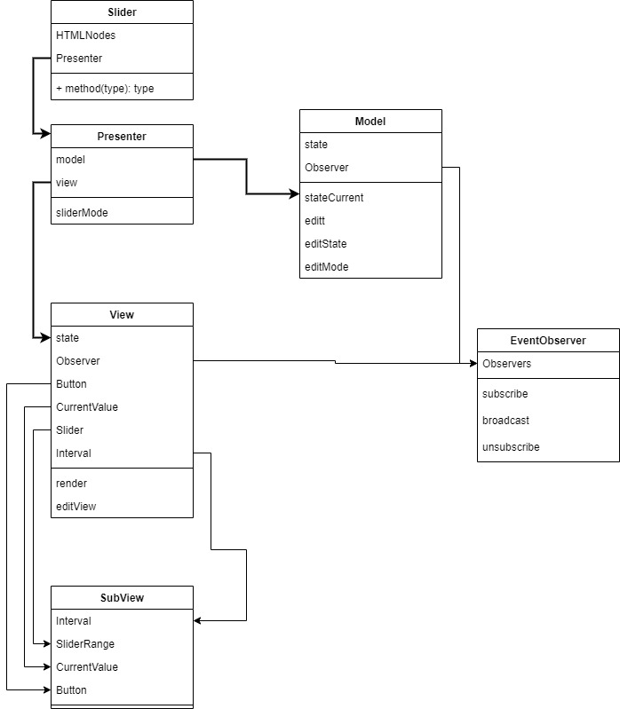

# **SliderRqik**
# [**Демо страница**](https://rqik.github.io/SliderPlugin/dist/)

**Использованные технологии**  
_TypeScript_  
_JQ_  
_HTML_  
_SCSS_  
_MVP pattern архитектуры_  
_Observer pattern_  
_JEST_  
_Webpack_  
_Eslint_  
_Prettier_  
_Babel_

## **Install**

1. Clone

```console
git clone https://github.com/Rqik/SliderPlugin.git
```

2. Open

```console
cd SliderPlugin
```

3. Init

```console
npm install
```

4.  Run

```console
npm run start
```

Build 
```console
npm run build
```
Test 
```console
npm run testCW
```
---

## **Model - View - Presenter**

**Model** -отвечает за текущее состояние слайдера, хранит в себе стартовые значения. Имеет методы для изменения текущего состояния и его возврата.

**View** - отвечает за визуальную отрисовку самого слайдера. Включает в себя отдельные компоненты **subView** и **Observer**. _**subView**_ - хранит в себе компоненты кнопок, подсказок, интервалов и активной зоны. **_Observer_** - добавляет **View** возможность передачи изменения состояния для подписчиков _subscriber_ без необходимости кто это будет. Он передает значение для всех subscriber через broadcast метод.

**Presenter** - отвечает за инициализацию **View** и **Model**. Решает вопрос с передачей данных между компонентами. Подписывается на изменения во View и вызывает соответствующие методы в Model. Принимает в себя значения для инициализации которые передает в Model. Служит посредником. Вызывает методы перерисовки в View и изменения состояния.

> _Для более удобного использования. Поверх Presenter
> используется class Slider для подключения нескольких Presenter
> к DomElement имеющим одинаковый selector переданный при
> инициализации._


## https://rqik.github.io/SliderPlugin/dist

## Способ подключения

Слайдер автоматически проинициализируется на элементах с классом
**_.js-slider-rqik_** , при этом опции можно передать через **_data_**  атрибуты.

```html
<div class="slider-rqik" data-min-value="-999"></div>
```

_Ручная инициализация_
```javascript
// index.html
<div class="plug"></div>;

// index.js
$('.plug').sliderRqik();
```

## Передача параметров

```javascript
$('.plug').sliderRqik({
  minValue: 0, // минимальное значение
  maxValue: 100, // максимальное значение
  range: 'two', // 1 или 2 указателя
  rotate: 'horizontal', // ориентация vertical horizontal
  show: true, // показывать текущее значение над указателем
  showInterval: true, // показать интервал
  intervalCount: 2, // количество интервалов
  stepSize: 1, // шаг движения указателя в числах
  currentVal1: 50, // установка значений в числах
  currentVal2: 0, // установка значений в числах
  shiftXl: 0,
  shiftXr: 0,
});
```

### minValue и maxValue

---

Устанавливают минимальные и максимальные значения слайдера  
По умолчанию 0 и 100

```javascript
$('.plug').sliderRqik({
  minValue: -10, // минимальное значение
  maxValue: 2880, // максимальное значение
});
```

### currentVal1 и currentVal2

---

Устанавливает стартовые значения кнопок  
По умолчанию 0 и 100

```javascript
$('.plug').sliderRqik({
  currentVal1: 10, // правая кнопка
  currentVal2: 0, // левая кнопка
});
```

### range

---

Устанавливает количество кнопок на слайдера  
Имеет два состояния **_two | one_**  
По умолчанию **_two_**

```javascript
$('.plug').sliderRqik({ range: 'one' });
```

### rotate

---

Устанавливает ориентацию слайдера  
Имеет два состояния **_vertical | horizontal_**  
По умолчанию **_horizontal_**

```javascript
$('.plug').sliderRqik({ rotate: 'vertical' });
```

### show

---

Отвечает за отображание или скрытие подсказок с текущим значением над кнопками  
Имеет два состояния **_true | false_**  
По умолчанию **_true_**

```javascript
$('.plug').sliderRqik({ show: false });
```

### showInterval

---

Отвечает за отображание или скрытие интервалов  
Имеет два состояния **_true | false_**  
По умолчанию **_true_**

```javascript
$('.plug').sliderRqik({ showInterval: false });
```

### intervalCount

---

Отвечает за отображание или скрытие интервалов  
Принимает числовой параметр от 0 и выше  
По умолчанию **_2_**

```javascript
$('.plug').sliderRqik({ intervalCount: 4 });
```

### stepSize

---

Задает шаг движения в **числах**
Принимает числовой параметр от 0 и выше  
По умолчанию **_0_**  

```javascript
$('.plug').sliderRqik({ stepSize: 10 });
```

## Передача параметров через data атрибут

```javascript
// index.html
<div class="plug" data-min-value="10" data-current-val1="20"></div>
```

## Установка значений для уже созданных слайдеров

Метод **_data_** принимает в себя объект с новыми параметрами для слайдера

```javascript
let slider = $('.plug').sliderRqik();
slider.data({ maxValue: 99999 });
```

## Получения текущих значений

Метод **_getData_** вернет массив с объектами в которых записаны текущие значения

```javascript
// index.html
<div class="plug"></div>
<div class="plug"></div>

// index.MVP
let slider = $(".plug").sliderRqik();
let res = slider.getdata()

// res = [{...},{...}]
```

[ Диаграмма ](https://viewer.diagrams.net/?highlight=0000ff&edit=_blank&layers=1&nav=1#R7Z1bb%2BI4FMc%2FDdLuQ0fkRsJjuXQuS2eq0p3t7MvKEBc8DTFyzG0%2B%2FdjEIYADNSUm7cpVpWLnJMT%2B%2Fc%2FJie2kNac9WX4kYDq%2BxSGManY9XNacTs22rboTsD%2B8ZpXWeK6oGBEUCqO8oo9%2BwWxPUTtDIUx2DCnGEUXT3cohjmM4pDt1gBC82DV7wtHut07BCEoV%2FSGI5Np%2FUEjHaW1g%2B3n9J4hG4%2BybrUYz3TIBmbFoSTIGIV5sVTndmtMmGNP002TZhhHvvKxfPt3UO%2B1r5%2Bu8efPjr%2F8Gj8vwG71KD3Zzyi6bJhAY01cfeta7%2F5rg3vUX8Pxwh0adngWR2KU%2BB9FM9NcdgQn7GkhEo%2Bkq68lkgSYRiFmp9YRj2hdbLFYGERrF7PMw3dNpzSGhiEG4FhsonrLa4RhFYQ%2Bs8Iw3I6Fg%2BJyVWmNM0C92WBCJY7LNhAo92Y0diz7fk1XXWS07XWZzl%2FWNtVd1C5Y7hj2QUFExxFEEpgkabJoxAWSE4hamFE%2BEkWLXC0S82XC5JTyB4iPEE0jJipmIrYHoeeFVVlOUF7lGrYaoG%2B%2Fo0xa%2BIfxitDl0zp59EPhPkEJTksIkDQZ7MmANpGs8BD%2FDNo4w492JcaoLFEV7VZk0IvhEDwojmYIhike9tU3HzWvuRct5FWb7PkVrDxyjMIQxh4opoCAlyHFNMYrpume8FvtlHdiuf%2FBqHjvxNitbeZn9cnNC2zhmbQFozRcyeSwgl0gB%2BaMe9DJ5gZppWYl0Zlc6aEsCPUdwUePf51i55g3y0pB7dsXIbQm5xDhCa3Yp4%2BxKab0K8IShimBO9IED71xZEnVHpu4UEI7AAEZ3OEEUYX58ktruka8Krh%2BowQ1OZosHP3lGZNfXHSAuwhFLpwhP0wTBRBwvScJEVIVJuA35qDKcrbYJJRnHL00bgb5Yz4pCHyfEAVeKA9%2FXod9kehfL9JympagJV1em50kqYAQolGRgvL%2FQed5PpmfLpL8NEkjmBXd3BvZ5sC%2BZ4z32%2FMGU3H%2Fufln406T11Pzx0LtqSKxbMxbeYkO6ZNKqCZ820rJXt2eEt%2FL7usbwLpe3VXcrjuO%2BBLy%2Fvg0wqMtG7SgOw2nzbUsekf3MM21WNrTLpu1VnaDJ12wJshmXeS3dQDEjO31gRg2uI1%2BnWRtN2NaAWnX2RN%2BdliOxhiGihaMrhvaZt9VW1WHbkmnfFs6VmYG0EgfSnMbuSJrlO2o62ISH8oUgD6iaoTQFn9840JscS3vutu4B%2Bdt%2FXEwe%2Fm3cdEcouilI1cxQmi7Ylc%2BXWnLqZhLz0vDqmzFVc%2BVsCc1%2B1BajaMafywaucRpUkbi85oWn59QsetFIfbNUrbq7Mjk949j7JkXTwtu54MRI8TnLSRrnvbVaxuAuD3ej6mkRK5Bw92cDs6LlwitafEtx9G0TIMofapUd38yaKDp%2BoIz%2FrSxrcQr8fj0feg%2FikYn0pQOv%2FHbckSfAzYoHncQvucSl%2BJTlp1HMaiY9rKtf3pI9YGdG27TwVV3Tois5s%2BXkrDtnrTw4fm6S9RKTdW9v1sy1VbN1T9esmS1fzjMtJJIYTHwvdqb3k67bcrpuwntpeFWTc2233vLFO5kNkiFBA5OYl067oRi8HV2x25FnUgYEg3DIL3cGd8m4Vde1acNty%2Fdhs9j4tzbglmp2ps%2FBZeIHHjYwabq%2BMXVPNUnX9joQV76uf3q47X3F%2FG0%2Bxu%2BP%2Bv3Gh95Pku7KS1oPvwnI4D4Td%2BUj6q6cxpl7stLwXnCBWzFdu4Aua26dHX6Mwz%2Foagr%2FrDnXrIZ%2FNP5dtgAuueCt8DHCusQUhiOYpWisS8Z4hGMQdfNa1tGzOISh6ObcpofX3sqd9SekdCVyMDCjmGdhdJJnaNuRwj45W0rwjAzhMV2LixTLBEfwGDHRfN7mo7gIjABF822jYhhi1zuuvTxpc3aTts2bArMjpOcpdsqJXhMCVltmQtEHv2b%2FuQexOvlGzdyu14%2BaB9Yxc%2FYhPd1ci5v%2Be7085YvNBeTJNEhWj2L%2FdeEHL7BYIYqd5fbGzkqUtMs6ey3mS6r2ylb1WSHGfU8MSybmKxLLVqqUHIjODCCe454SQHzfq2mPCH4Vanq9Ko69l%2BNlVfhvQhXe%2FpBDcFQVe%2BZB3dKviuB%2FoIqGoiqyJS8Vq2Ivp3HFU%2FSHVLFnHtiND82tn0C%2FRrJnO961SLIltC%2FHjsabUIl0SWkcTzL37RviLduHZXWeve%2Fu2GtSXiVprPZ0tKkasJyq8tHCZ7ya7ysMHHvI%2BMWut0vPIM57vK6S4YY3ci9gq6Z95UN7Veh290KlK96CdCi0yvZnhVZWzP9lQmqe%2F%2BMJp%2Fsb)

